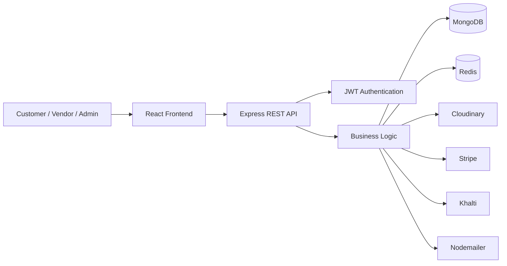

<div align="center">

# 🛍️ ShopMandu

### A Full-Stack Multi-Vendor E-Commerce Marketplace

_A scalable marketplace platform where customers, vendors, and administrators collaborate through a unified shopping experience._


</div>

---

# 📖 Overview

**ShopMandu** is a modern **multi-vendor e-commerce platform** that enables multiple businesses to sell products through a single online marketplace. The platform provides dedicated experiences for **customers**, **vendors**, and **administrators**, while maintaining a centralized infrastructure for authentication, order management, product management, payments, analytics, and marketplace administration.

---

# Project Goals

ShopMandu was developed with the following objectives:

- Build a scalable multi-vendor marketplace
- Provide a seamless shopping experience
- Enable independent vendor management
- Deliver secure authentication and authorization
- Simplify product and order management

---

# Business Value

ShopMandu provides value to three primary user groups.

| User           | Value                                                                                                                            |
| -------------- | -------------------------------------------------------------------------------------------------------------------------------- |
| Customers      | Browse products from multiple vendors, compare offerings, place orders, manage returns, and securely complete purchases.         |
| Vendors        | Operate independent storefronts, manage inventory, fulfill orders, monitor sales, and leverage AI-assisted product descriptions. |
| Administrators | Oversee marketplace operations including users, vendors, shops, products, categories, coupons, payments, and platform activity.  |

---

# Key Features

## Customer Features

- User registration and authentication
- Google OAuth authentication
- Product search
- Category filtering
- Product details
- Shopping cart
- Wishlist
- Address management
- Secure checkout
- Online payments
- Coupon support
- Order history
- Order tracking
- Ratings
- Return and refund requests
- User profile management

---

## Vendor Features

- Vendor registration
- Vendor authentication
- Vendor dashboard
- Shop creation
- Shop profile management
- Product CRUD
- Product image management
- AI-generated product descriptions
- Inventory management
- Order management
- Sales overview
- Revenue tracking
- Return request approval
- Return request rejection

---

## Administrator Features

Marketplace administrators can manage the complete platform through an administrative dashboard.

### User Management

- Manage users
- Manage vendors
- Vendor verification

### Product Management

- View all products
- Manage marketplace inventory
- Category management
- Coupon management

### Marketplace Operations

- Order management
- Payment monitoring
- Return request management
- Sales analytics
- Platform activity monitoring

---

## Authentication & Security

- JWT Authentication
- Google OAuth
- Role-Based Access Control (RBAC)
- Password hashing
- Secure token management
- Input validation using Zod
- Helmet security middleware
- Configurable CORS policy
- Redis-backed rate limiting

---

## Payments

Supported payment integrations include:

- Stripe
- Khalti

---

## Order Management

- Place orders
- Order confirmation
- Order status tracking
- Order history
- Invoice generation
- Return requests
- Refund workflow
- Vendor order processing

---

## AI Features

ShopMandu includes AI assistance for vendors by generating product descriptions, reducing manual effort while maintaining consistent product listings.

---

# 🛠️ Technology Stack

## Frontend

| Technology                 | Purpose             |
| -------------------------- | ------------------- |
| React                      | User Interface      |
| Tailwind CSS               | Styling             |
| React Router               | Client-side Routing |
| Zustand                    | State Management    |
| React Icons & lucide icons | Icon Library        |

---

## Backend

| Technology | Purpose            |
| ---------- | ------------------ |
| Node.js    | Runtime            |
| Express.js | REST API Framework |
| Zod        | Request Validation |

---

## Database

| Technology | Purpose          |
| ---------- | ---------------- |
| MongoDB    | Primary Database |

---

## Caching & Performance

| Technology | Purpose                           |
| ---------- | --------------------------------- |
| Redis      | Rate limiting and caching support |

- Caching is still pending for this version.

---

## Authentication

| Technology   | Purpose        |
| ------------ | -------------- |
| JWT          | Authentication |
| Google OAuth | Social Login   |

---

## Storage

| Technology | Purpose               |
| ---------- | --------------------- |
| Cloudinary | Product image storage |

---

## Payments

| Provider | Purpose          |
| -------- | ---------------- |
| Stripe   | Online Payments  |
| Khalti   | Digital Payments |

---

## Email

| Technology | Purpose        |
| ---------- | -------------- |
| Nodemailer | Email Delivery |

---

## Development Tools

| Tool   | Purpose         |
| ------ | --------------- |
| Git    | Version Control |
| GitHub | Source Control  |
| Figma  | UI/UX Design    |

---

# Architecture Overview

ShopMandu follows a layered architecture where the React frontend communicates with a RESTful Express.js backend. The backend is responsible for authentication, authorization, business logic, product management, orders, payments, and integrations with external services such as Redis, Cloudinary, payment gateways, and email providers.

---

## High-Level Request Flow



The backend follows a modular routing structure, separating concerns into authentication, users, vendors, shops, products, categories, carts, wishlists, orders, reviews, payments, coupons, AI services, return requests, and contact functionality. Cross-cutting concerns such as security headers, CORS, centralized error handling, Redis connectivity, and request rate limiting are configured at the application level, providing a clean and maintainable foundation for future development.

---

# Project Organization

ShopMandu is organized as a monorepo containing two independent applications: a backend API and a frontend web application.

| Directory | Description                                                                                                                                                                    |
| --------- | ------------------------------------------------------------------------------------------------------------------------------------------------------------------------------ |
| **api/**  | Backend REST API that handles authentication, business logic, database operations, payment processing, media storage, AI services, email delivery, and marketplace management. |
| **web/**  | React-based frontend application providing dedicated interfaces for customers, vendors, and administrators.                                                                    |

This architecture promotes modularity, maintainability, and scalability by separating presentation, business logic, and infrastructure concerns.

---

# Documentation

Each application contains its own documentation with detailed setup instructions, environment configuration, and development workflow.

| Documentation     | Purpose                                                                                             |
| ----------------- | --------------------------------------------------------------------------------------------------- |
| **README.md**     | Project overview and architecture                                                                   |
| **api/README.md** | Backend installation, configuration, API documentation, environment variables, and deployment guide |
| **web/README.md** | Frontend installation, development workflow, environment configuration, and build instructions      |

---

# 🚀 Quick Start

Get ShopMandu up and running by following these high-level steps.

### 1. Clone the Repository

```bash
git clone https://github.com/Purnima8555/Shopmandu-Website.git
```

### 2. Navigate to the Project Directory

```bash
cd Shopmandu-Website
```

### 3. Set Up the Backend

Follow the complete backend installation and configuration guide:

📄 **[Backend Documentation](./api/README.md)**

### 4. Set Up the Frontend

Follow the complete frontend installation and configuration guide:

📄 **[Frontend Documentation](./web/README.md)**

### 5. Configure Environment Variables

Create the required `.env` files for both the backend and frontend using the provided `.env.example` templates.

### 6. Run the Applications

Start both the backend and frontend applications by following the instructions in their respective documentation.

> **Note:** Ensure that MongoDB, Redis, Cloudinary, and the required payment service credentials are properly configured before running the application.

---

# 📸 Application Screenshots

The following screenshots highlight the core user experience across the ShopMandu platform, including customer, vendor, and administrator interfaces.

## Homepage

<p align="center">
  
</p>

---

## Login

<p align="center">
  
</p>

Secure authentication using JWT and Google OAuth.

---

## Forgot Password

<p align="center">
  
</p>

Recover your account securely via email verification.

---

# 🛍️ Customer Experience

## Homepage

<p align="center">
  
</p>

Browse featured products, categories, flash sales, and promotions from multiple vendors.

---

## All Products

<p align="center">
  
</p>

Explore the marketplace with search, filtering, sorting, and category-based product browsing.

---

## Product Details

<p align="center">
  
</p>

View product information, pricing, ratings, stock availability, and purchase options.

---

## Shopping Cart

<p align="center">
  
</p>

Manage selected products before proceeding to checkout.

---

## Wishlist

<p align="center">
  
</p>

Save products for future purchases.

---

## Order Tracking

<p align="center">
  
</p>

Track order progress and monitor delivery status.

---

## User Profile

<p align="center">
  
</p>

Manage account information, addresses, and profile settings.

---

## Contact Us

<p align="center">
  
</p>

Contact platform administrators through the integrated support form.

---

# 🏪 Vendor Dashboard

## Dashboard Overview

<p align="center">
  
</p>

Monitor sales, inventory, orders, and overall shop performance.

---

## Vendor Homepage

<p align="center">
  
</p>

---

## Shop Profile

<p align="center">
  
</p>
## Product Management

<p align="center">
  
</p>

## Account Settings

<p align="center">
  
</p>

---

# ⚙️ Administrator Dashboard

## Dashboard

<p align="center">
  
</p>

View marketplace analytics, system statistics, and platform activity.

---

## User Management

<p align="center">
  
</p>

---

## Shop Management

<p align="center">
  
</p>

---

## Coupon Management

<p align="center">
  
</p>

Create, update, and manage promotional coupons across the marketplace.

---

# Security

Security is implemented throughout the application using multiple layers of authentication, authorization, validation, and infrastructure protection.

## Authentication & Authorization

- JWT-based Authentication
- Google OAuth Authentication
- Role-Based Access Control (RBAC)
- Secure Password Hashing
- Protected API Endpoints
- Session & Token Management

---

## API Security

- Helmet security middleware
- Configurable CORS policy
- Request validation using Zod
- Centralized error handling
- Environment-based configuration
- Protected REST API architecture

---

## Rate Limiting

Redis-backed rate limiting is implemented to help protect the platform from abuse and excessive requests.

| Endpoint                          | Policy                                 |
| --------------------------------- | -------------------------------------- |
| Authentication & Protected Routes | **10 requests per minute per IP**      |
| Contact Us                        | **3 requests every 30 minutes per IP** |

---

<div align="center">

Made with ❤️ using React, Express, MongoDB, Redis, and Tailwind CSS.

</div>